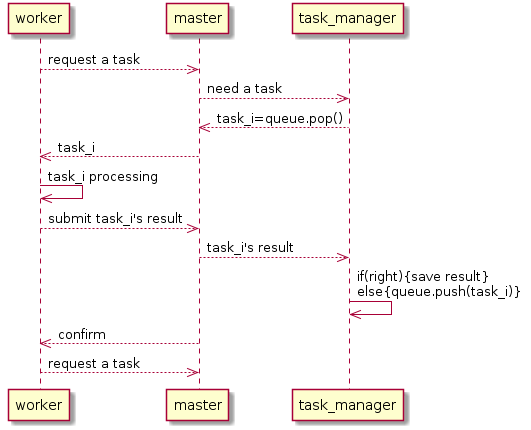
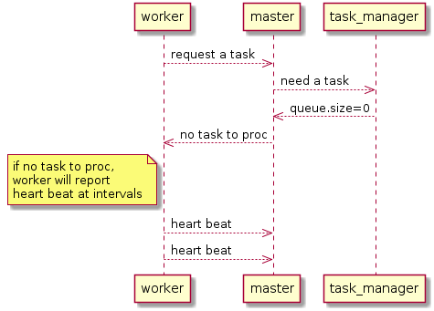

# SparkDroid(安卓系统上的分布式)

Hi! 这是一款开源android应用，我想通过它来实现移动端的分布式任务处理，希望做到去中心化、免配置、易使用。因为目前所有的分布式框架都是基于pc的，若要移植到android，需有root权限，且需要复杂的配置。虽然android也是基于Linux的系统，但封印了好多功能，尤其是root权限的限制，导致普通android手机不能直接部署现有分布式框架。总而言之，现有的分布式很好，但太重量级了。

# 使用说明

目前此app的功能非常简单，只是一原型，实现了简单的任务下发和任务提交功能，使用时一定要在**同一局域网下！！！**，因为手机运营商不允许我们直接p2p，若非要摆脱局域网，可以选择给设备配置内网穿透。下面是使用步骤：

- Step0: "source python"框输入要执行的任务代码，[测试代码demo及代码格式说明在"/doc/demo/main.py"中)](doc/demo/main.py)。

- Step1: master端输入master启动端口。master的IP固定为127.0.0.1，修改无效；端口任意，只要是未被占用就行。

- Step2: 点击MASTER按钮以启动“工头”。（最初的做法：点击一次master之后会从"source python"复制多份相同的任务(就是单纯的复制，因为最初没有设计动态任务拆分)，等待Worker的任务请求，这种做法适合任务之间完全独立的场景；目前的做法：不同任务间的区别只是其参数不同，适用于广度搜索这样的场景，详细说明见Step0中的[main.py](doc/demo/main.py))。

- Step3: worker端输入master的IP和端口。再次申明，IP必须填局域网IP，因为手机运营商不允许我们直接p2p。

- Step4: 点击WORKER按钮以启动一个“工人”。每点击一下WORKER就会生成一个worker，worker的端口是自动分配的。master端当然也可以启动自己的worker，这时IP可以填127.0.0.1，也可以填局域网下的IP。

- Step5: 点击STOP&CLEAN以关闭本地所有master和worker并清理控制台

# 运行流程

- 流程非常简单，就是普通的tcp通信，然后自己写了个处理逻辑。以线程为单位，线程之间的通信流程如下：

- 如果没有任务了：

# 其他

目前此应用还不能称得上分布式，因为性能还很低，可以执行的任务很有限，不过这只是个开始，慢慢做吧。

# 更新日志

### 更新chaquopy至7.0.2，更新tensorflow至2.1.0

### 新增tensor分布式功能--2020.04.01

此功能可以[将tensor计算图运行在多个设备上](https://www.tensorflow.org/tutorials/distribute/custom_training)，结合chaquopy，就实现了安卓上的“分布式tensor”。
> 这次的更新算是实现了真正意义上的分布式，但是和之前自定义的任务执行模式无关，因为这次完全是依靠tensorflow自家的任务处理策略(包括通信)，而我相当于一个搬运工。。。

具体使用方式还没封装好，大体有以下几个需要注意的地方：
- 你的Android手机可以作为Server(计算服务提供者)，也可以作为Client(任务发起者)，但不能同时启动Server和Client，因为这样会报错，原因不明。
- 当选择启动Server时，你需要设定几个参数，我把参数写在了[PythonTest.testTensorServer()](app/src/main/java/com/mrl/sparkdroid/PythonTest.java)里(也可以通过输入框动态设定，但嫌麻烦没弄)，参数的含义可以参考[server_ps.py](doc/demo/server_ps.py)。点击“TF SERVER”以启动一个Server。
- 当选择启动Client时，你需要先把任务代码写在代码输入框，demo可以参考[client_ps](doc/demo/client_ps.py)，然后点击“TF CLIENT”以启动Client。
> 使用前最好先稍微学习一下tensorflow的分布式使用方法

此外还实验了“用tensor分布式训练mnist数据集”，demo在[bp_ps1.py](doc/demo/bp_ps1.py)里，问题很多，所以先不加进来。